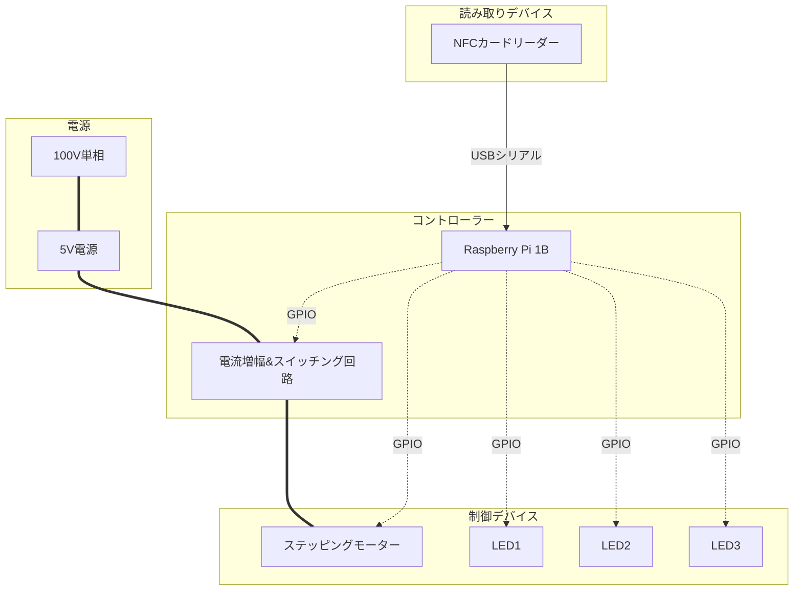

# ラズパイベース電気錠


## システム構成



import binascii
import RPi.GPIO as GPIO
import time
import datetime
#from retry import retry
import numpy as np

## external library
import nfc
import pandas as pd

## 処理の流れ
```mermaid
graph TD;
     BootRaspberryPi->Initial 
     USER--"card touch"-->;
     USER--"arg2:output directory name"-->IPBSMscanDATAconvertLoop.sh;
     IPBSMscanDATAconvertLoop.sh--"Fringe scan file (binary)"-->IPBSMdataConvertBinToText.sh;
     IPBSMdataConvertBinToText.sh--"Create converted dat file"-->IPBSMscanDATAconvertLoop.sh;
     IPBSMdataConvertBinToText.sh-->Node0[Python Process.];
     Node0---Node2[Intenisty dependence parameter Fit.];
     Node0---Node1[Modulation Fit.];
```
