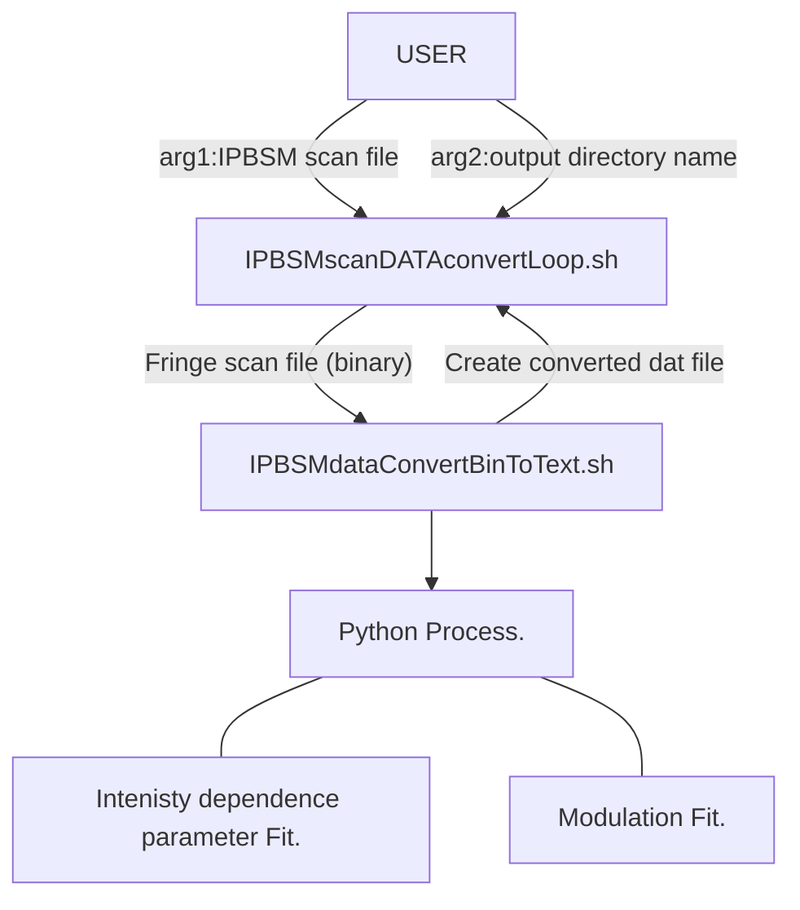

# ラズパイベース電気錠


## システム構成
```mermaid
flowchart TD;
    subgraph コントローラー
        RaspberryPi 1B;
        電流増幅スイッチング回路;
    end
    subgraph 電源
        100V単相;
        5V電源;
    end
    subgraph 制御デバイス
        ステッピングモーター;
        NFCカードリーダー;
        LED1;
        LED2;
        LED3;
    end
    100V単相===5V電源;
    5V電源===電流増幅スイッチング回路;
    NFCカードリーダー--->|USBシリアル|RaspberryPi 1B;
    RaspberryPi 1B-.デジタルI/O-.->ステッピングモーター;
    RaspberryPi 1B-.デジタルI/O-.->LED1;
    RaspberryPi 1B-.デジタルI/O-.->LED2;
    RaspberryPi 1B-.デジタルI/O-.->LED3;
```


