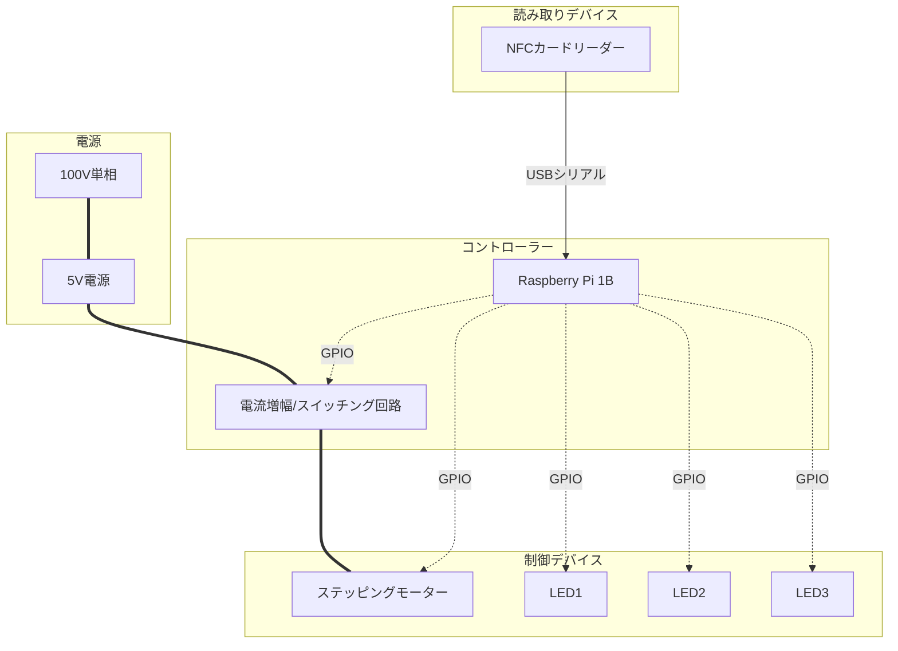
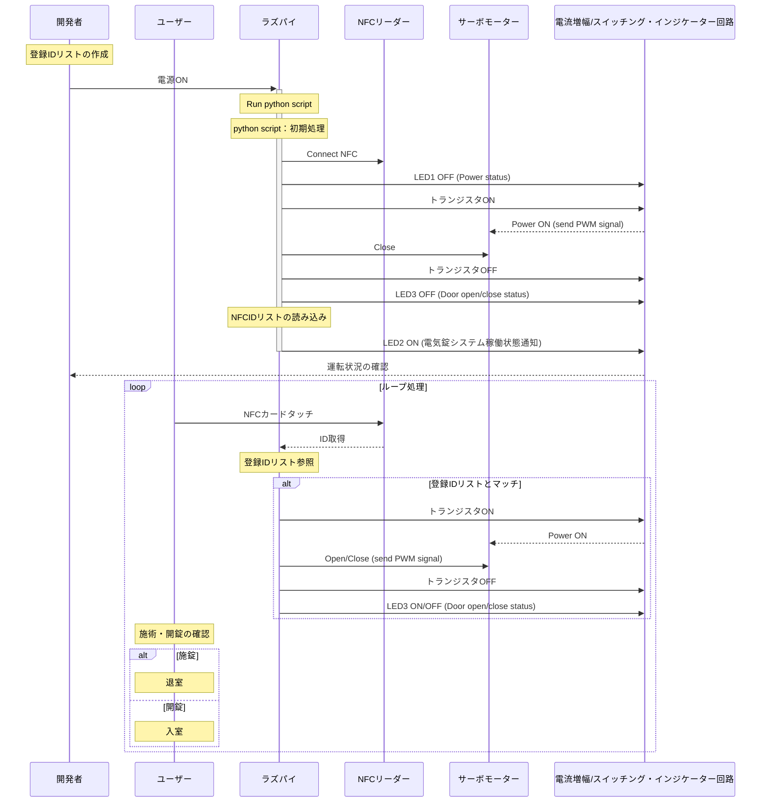

# ラズパイ駆動の電気錠

## システム構成
### 使用機材
- Raspberry Pi 1B
- ステッピングモーター（MG90S）
- NFCカードリーダー（"PaSoRi" RC-S380/S ??）
- 電流増幅/スイッチング回路（自作）

| | | |
|:-----------|------------:|:------------:|
||||
||||

### 環境
- python3
- ラズパイOS（rasbian ）
### python ライブラリ
- 内部ライブラリ
   - binascii
   - RPi.GPIO
   - time
   - datetime
   - numpy
- 外部ライブラリ
   - nfc （NFCリーダー制御用ライブラリ）
   - pandas

## 処理の流れ

