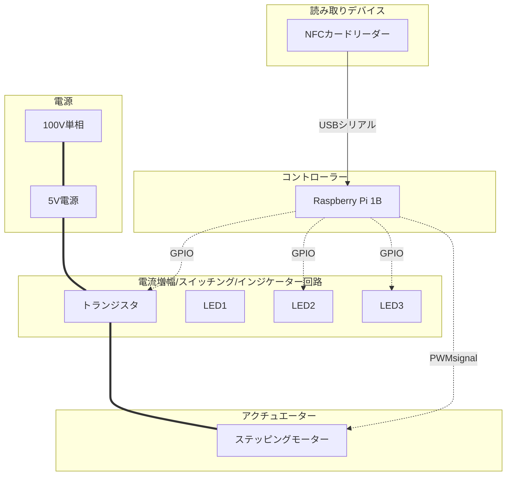
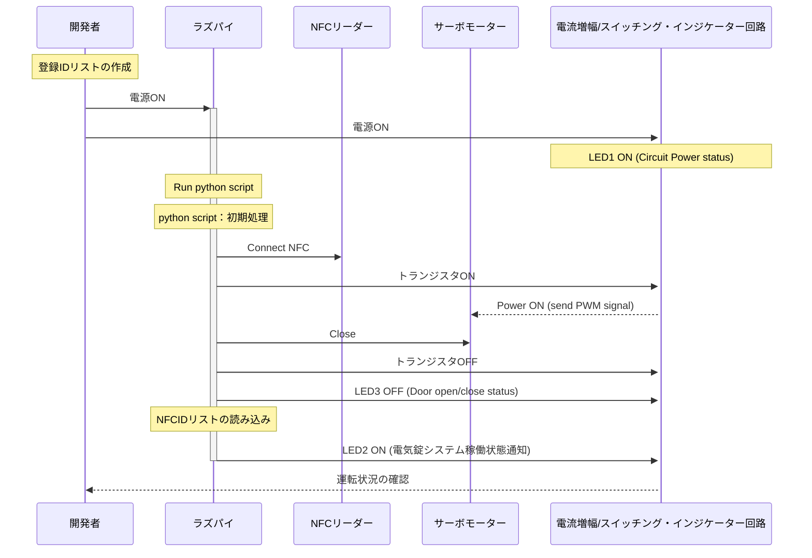
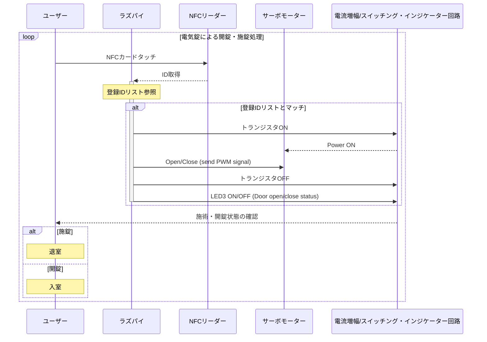

# ラズパイ駆動の電気錠

## システム構成
### 使用機材
- Raspberry Pi 1B
- ステッピングモーター（MG90S）
- NFCカードリーダー（"PaSoRi" RC-S380/S ??）
- 電流増幅/スイッチング回路（自作）

| | | |
|:-----------|------------:|:------------:|
||||
||||

### 環境
- python3
- ラズパイOS（rasbian ）
### python ライブラリ
- 内部ライブラリ
   - binascii
   - RPi.GPIO
   - time
   - datetime
   - numpy
- 外部ライブラリ
   - nfc （NFCリーダー制御用ライブラリ）
   - pandas

## 処理の流れ
サーボモーターはPWM信号のパルス幅を参照して対応角度まで駆動される。
ラズパイのPWM信号はパルス幅のジッターが比較的大きいので、終始PWM信号を入力するとサーボモーターが無駄にジリジリと動いてしまう（そこそこ不快な騒音源）。
物理鍵での開錠・施錠も考えて、開錠・施錠時のみサーボモーターを駆動するシステムにした。
初期起動時はデフォルトで施錠するようにしており（クラス内のコンストラクタで定義）、安全面上も気を使っている。
自動施錠等は必要ないとの判断であったため、開錠・施錠ステータスのフラグをpythonスクリプト上で持ち、その論理反転で開錠・施錠状態の管理を行っている。

### ラズパイ立ち上げ時の処理

### ラズパイ立ち上げ後の処理

