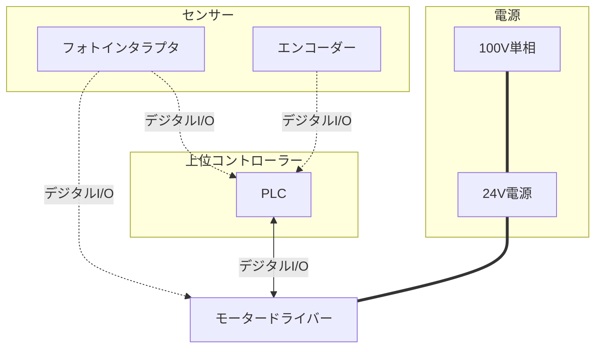
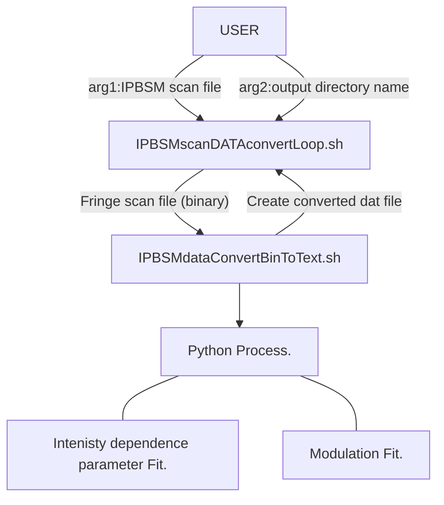

# ラズパイベース電気錠

```mermaid
flowchart TD;
    subgraph 上位コントローラー
        PLC;
    end
    subgraph 電源
        100V単相;
        24V電源;
    end
    subgraph センサー
        フォトインタラプタ;
        エンコーダー;
    end
    100V単相===24V電源;
    24V電源===モータードライバー;
    PLC<-->|デジタルI/O|モータードライバー;
    フォトインタラプタ-.デジタルI/O-.->PLC;
    フォトインタラプタ-.デジタルI/O-.->モータードライバー;
    エンコーダー-.デジタルI/O-.->PLC;
```

```mermaid
graph TD;
     USER--"arg1:IPBSM scan file"-->IPBSMscanDATAconvertLoop.sh;
     USER--"arg2:output directory name"-->IPBSMscanDATAconvertLoop.sh;
     IPBSMscanDATAconvertLoop.sh--"Fringe scan file (binary)"-->IPBSMdataConvertBinToText.sh;
     IPBSMdataConvertBinToText.sh--"Create converted dat file"-->IPBSMscanDATAconvertLoop.sh;
     IPBSMdataConvertBinToText.sh-->Node0[Python Process.];
     Node0---Node2[Intenisty dependence parameter Fit.];
     Node0---Node1[Modulation Fit.];
```

